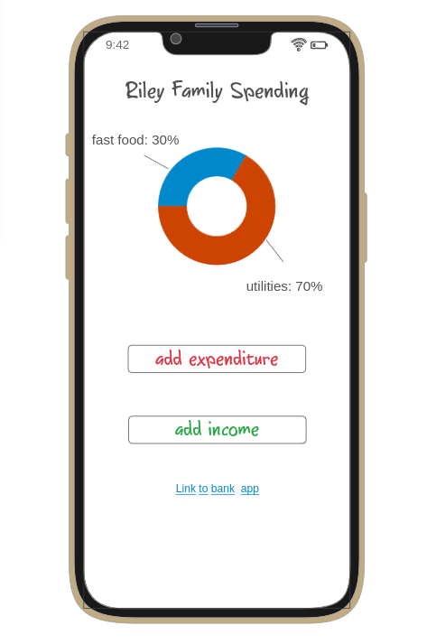
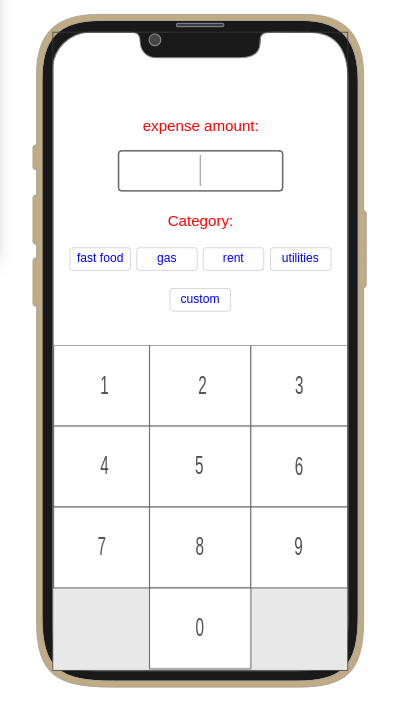

# Budget Tracker
### Startup for CS 260 Winter 2025

## Elevator Pitch
My app will be tailored to young families like my own who need to save money and keep track of expenses. The users will be able to log in as a member of a family and view and edit goals and expenditures. This will allow both spouses to be equal partners in managing money, as well as viewing progress toward joint goals. The main attraction of this app will be the graphical representations of spending habits to incentivize frugality (as James Clear describes in _Atomic Habits_, it's important to make _not_ spending as rewarding as spending.)

## Key Features
* Secure login 
* Persistent transaction data
* A pie chart of expenditures based on category updated in real time
* Ability to select either `income` or `expense`
* Ability to input income/expense `amount` and `category`
* Visible transaction history that displays `name`, `date`, `amount`, `category` 

_Depending on difficulty, these features could be added:_
  * A progress bar toward goals e.g., `Your restaurant date fund is half full. Keep it up!`
  * Encouraging updates e.g., `Your spending on car parts is down 20 percent from last month. Way to go!`
  * Access to bank account for automatic updates

  
  

## Technologies
1. **HTML** - Uses correct HTML structure for application. Three HTML pages:
   * Login
   * Home screen with the pie chart and options for entering a transaction
   * Transaction history
2. **CSS** - Application styling that looks good on different screen sizes, uses good whitespace, color choice, and contrast.
3. **React** - Routing and the following graphical components:
   * Pie chart/progress bar
   * Buttons for transaction input
   * Transaction list
   * Income/expenses color-coded
4. **Service** - Backend service with endpoints for:
   * Login/out
   * Retrieving from the database to update the dashboard
   * Entering a new transaction
   * User/family data
   * Categories (custom and stock)
   
5. **DB** - Store family member authentication information, family members, transactions, categories, and goals in the database.

6. **WebSocket** - As each family member records a transaction, their transaction appears in the list and pie chart visible to all others _in that family_.

## HTML Deliverable
* **HTML pages** - Three HTML pages that represent the ability to login, the home dashboard, and the transaction history.
* **Links** - The login page automatically links to the dashboard page. The dashboard page links to the transaction history. The footer on each page links to my github repo. The dashboard links to the placeholder image.
* **Text** - Textual titles, and text options and prompts for transaction infput.
* **Images** - The dashboard contains an AI-generated placeholder image. Soon, it will be replaced by a third-party API call for a graphic representation of expenses by category
* **DB/Login** - Input box and submit button for login. Transaction history pulled from the database.
* **WebSocket** - The transaction history is updated across devices through websocket after each transaction input.

## CSS Deliverable
* **Header, footer, and main content body** - added a  consistent background and imported a themed font
* **Navigation elements** - pretty buttons that change color and expand while hovering. they also change the cursor. hyperlinks and navigation links change color on hovering.
* **Responsive to window resizing** - using flexbox, content cards appear in rows or columns based on view window ratio.
* **Application elements** - expandable table features consistent row sise and column alignment regardless of entry size.
* **Application text content** - pleasant, old-fashioned font consistent with theme and target audience.
* **Application images** - placeholder image constrained to appropriate size.

## React part 1 deliverable
* **Bundled using vite** pretty slick how that does so much automatically. it actually makes the rest pretty doable.
* **React components** Login, Dashboard, and Transactions are nested components inside Routes
* **Hooks** no hooks yet
* **Routes** I used routing to navigate between my three pages.
* **Bundled and Transpiled** - done!
